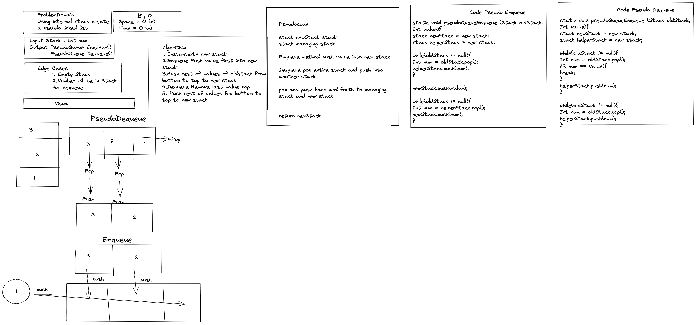

# PseudoQueue

Only using internal stacks and pop, push, and peek methods,
create a pseudo queues enqueue methods and dequeue methods.

### Contributor: Joshua McCluskey

### White Board Process

## Approach & Efficiency

This approach is using a two stacks a helper stack and a new stack, which is where the pseudo queue will be returned.

The Big O for time O(n) for the multiple loops used to go through the time stack O(n) having to go through each part of the stack.

#### Work Time: 2 hours
