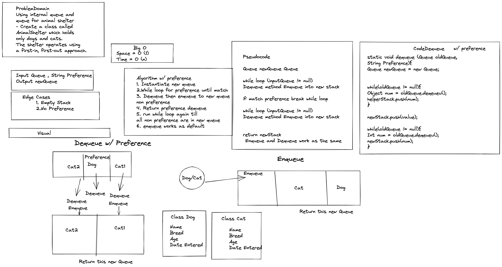

# Animal Shelter

- Create an animal shelter that has cats and dogs with a First In First Out structure.

- Create a dequeue method that takes in a preference of a dog or cat removes and returns new queue

### Contributor: Joshua McCluskey

### White Board Process

## Approach & Efficiency

This approach is instantiating a new queue, and  dequeue and enqueueing the non preference animals into so they keep their order.
Dequeue the preference animal and then dequeue and enqueue the rest of the animals into the new queue.

Stacks and queues have time complexity O(1) and space complexity of  O(n).

#### Work Time: 2 hours
