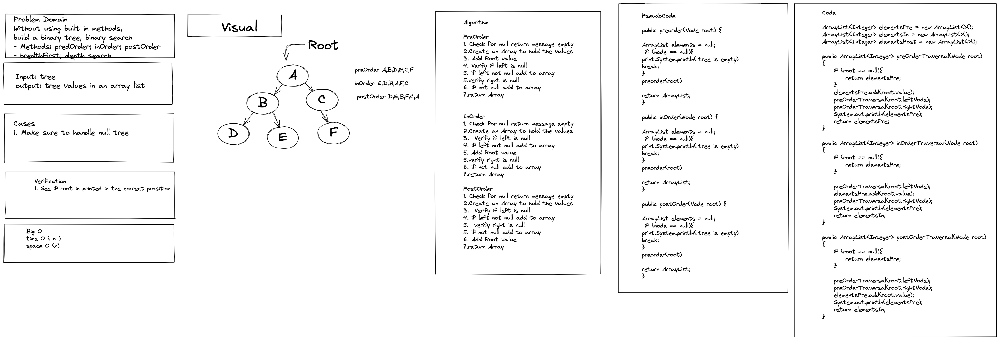

# Trees

Create Tree Methods

Traversal Methods:
preOrderTraversal
inOrderTraversal
postOrderTraversal

Binary Search methods:
depthFirstSearch
breadthFirstSearch

### Contributor: Joshua McCluskey

### White Board Process

## Approach & Efficiency

Took the recursive approach for each method traversals. 

Big O notation: Time Complexity O(n) and Auxillary Space complexity O(n).

#### Work Time: 3 hours