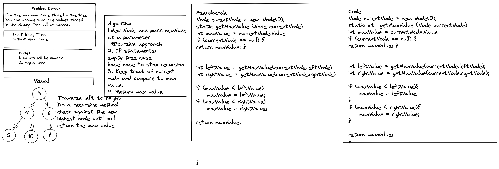

# Tree Max

Create Tree Methods

Get the max value in a binary tree

### Contributor: Joshua McCluskey

### White Board Process

## Approach & Efficiency

Took the recursive approach to find the max value going back and forth between the left and the right.

Big O notation: Time Complexity O(n) and Auxillary Space complexity O(n).

#### Work Time: 2 hours