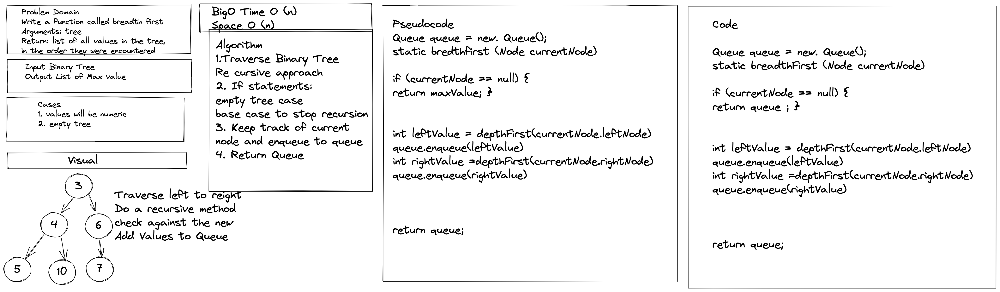

# Tree Breadth First

Create Breadth First method that takes all values and returns a list

### Contributor: Joshua McCluskey

### White Board Process

## Approach & Efficiency

Took the recursive approach to to traverse and get all values of the breadth first.

Big O notation: Time Complexity O(n) and Auxiliary Space complexity O(n).

#### Work Time: 1 hour