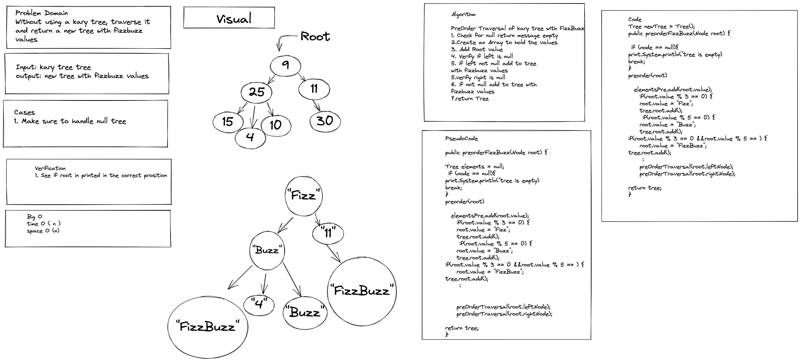

# Tree Fizz Buzz

Create Fizz Buzz method that retuens a new tree based on the following criteria:
- If the value is divisible by 3, replace the value with “Fizz”
- If the value is divisible by 5, replace the value with “Buzz”
- If the value is divisible by 3 and 5, replace the value with “FizzBuzz”
- If the value is not divisible by 3 or 5, simply turn the number into a String.

### Contributor: Joshua McCluskey

### White Board Process

## Approach & Efficiency

Took the recursive approach to preorder traverse and added the condtionals
for the FizzBuzz criteria

Big O notation: Time Complexity O(n) and Auxiliary Space complexity O(n).

#### Work Time: 1 hour