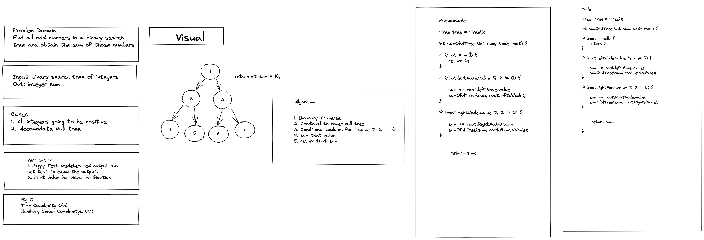

# Tree Sum Odds

Create a method that returns the sum off all odd numbers in a binary tree:
- If the value is not divisible by 2

### Contributor: Joshua McCluskey

### White Board Process

## Approach & Efficiency

Took the recursive approach to preorder traverse and added the condtionals
for to add odd numbers

Big O notation: Time Complexity O(n) and Auxiliary Space complexity O(1), but later discussed why it owuld be 
O (n) in the space complexity of the recursive approach.

#### Work Time: 30 minutes