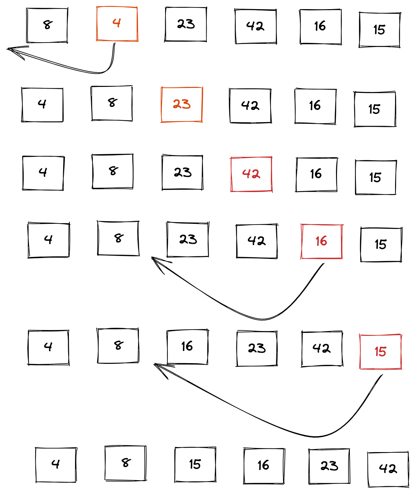

# Insertion Sort

- Insertion sorting algorithm is a sorting algorithm where one side is sorted and the other side is unsorted. 
The unsorted side will iterate and compare itself to one index to see if it's greater than or equal to it, 
and compares the previous number to see if its less than the previous number. If both are true then insert the number.


- Insertion sort is like organizing a military formation for like marching. In the very beginning, everyone needs to 
sort themselves from tallest to shortest. Everyone will then compare themselves to the person in front of them. If the person in 
front of them is shorter than them, the person taps them on the shoulder to step to the side and let them take their place.
 In a nutshell, this is the first real world example I could think of for insertion sort.

````Java
//Pseudo Code Insertion Sort
// InsertionSort(int[] arr)

    // FOR i = 1 to arr.length

     //  int j <-- i - 1
      // int temp <-- arr[i]

     //  WHILE j >= 0 AND temp < arr[j]
     //   arr[j + 1] <-- arr[j]
     //   j <-- j - 1

      // arr[j + 1] <-- temp
````

## Example

`[8,4,23,42,16,15]`



- In this example you see that each number except the first number is compared. So the sort will start at the index
of 1. Then it will go on to index of 2 and so forth. Each number comparing itself to the number in front and behind like
in our real life example marching formation example sorting from tallest to shortest instead in this case it's the smallest
number in the beginning of the array and larger near the end. 