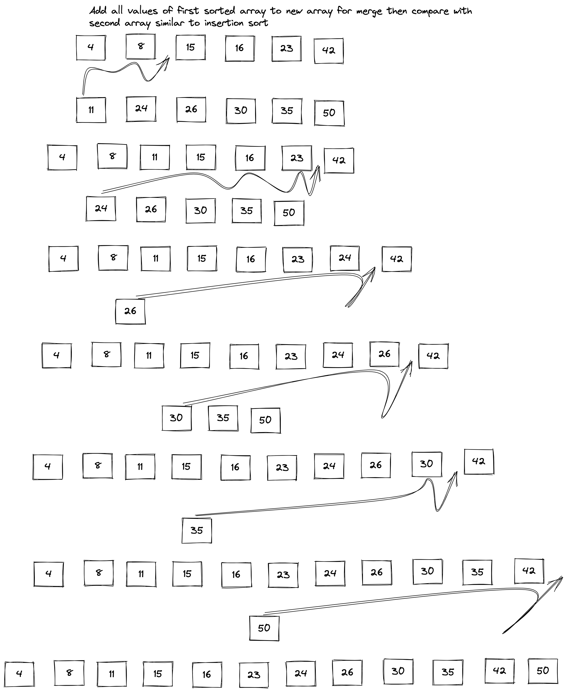

# Merge  Sort

- Merge sort is a soritng algorithm that takes an array and splits it into half and then sorts ewach half
and merges the two arrays and adds them to a new array soriting the array again. In the first example we will
go over why it's important to split and sort and then merge. The follwoing is the pseudo code that we will be following.

````Java
//ALGORITHM Mergesort(arr)
    //DECLARE n <-- arr.length

   //if n > 1
      //DECLARE mid <-- n/2
     // DECLARE left <-- arr[0...mid]
     // DECLARE right <-- arr[mid...n]
      // sort the left side
     // Mergesort(left)
      // sort the right side
      //Mergesort(right)
      // merge the sorted left and right sides together
     // Merge(left, right, arr)

//ALGORITHM Merge(left, right, arr)
    //DECLARE i <-- 0
    //DECLARE j <-- 0
   // DECLARE k <-- 0

   // while i < left.length && j < right.length
      //  if left[i] <= right[j]
           // arr[k] <-- left[i]
           // i <-- i + 1
     //   else
           // arr[k] <-- right[j]
          //  j <-- j + 1

       // k <-- k + 1

    // if i = left.length
       // set remaining entries in arr to remaining values in right
   //  else
      // set remaining entries in arr to remaining values in left

````

- In this example you can see that an array is split in half and each half is sorted. After each side is sorted the 
then the two sides are merged together. At first glance in thee small scale, you might ask why not just do a insertion sort.
The follwoing example beginds to display when arrays start to get larger, and why it is more efficient than insertion sort.

- In this example imagine trying to do the sort on a larger array and imagine doing an insertion sort one array with
all the follwoing values. You would be waiting around longer as it scales in the worst case scenario.



- The Big O notation time complexity of insertion sort is O (n ^ 2) which is terrible as we get larger arrays
The time complexity of merge sort is O (n log (n)) which more optimal than the insertion sort.