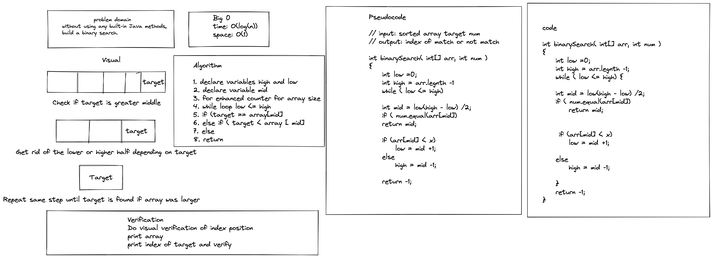

# Binary Search of Sorted Array

Without using built-in java methods, build a binary search of sorted array and return index of target.

### Contributor: Joshua McCluskey

### White Board Process

## Approach & Efficiency

I took the iterative approach using a while loop with conditions modifying the midpoint for binary search

The Big O for time O(log(n)) and the space is O(1).

#### Work Time: 2 hours

