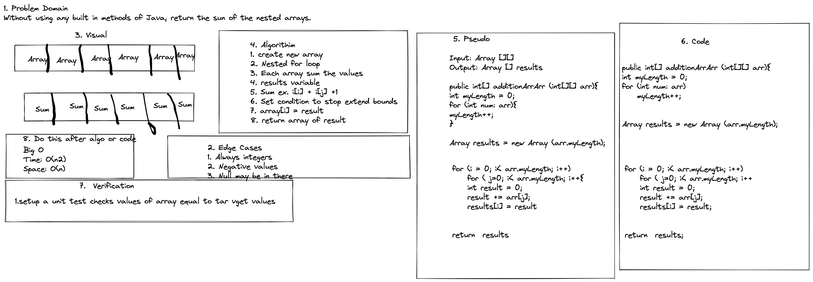

# Sum of 2 Dimensional Array

Without using built-in java methods, add the sum of all values of the arrays

### Contributor: Joshua McCluskey

### White Board Process

## Approach & Efficiency

I took the nested for loop approach to deal with the 2 dimensional array.
I saved the sums for each array into a results array.

The Big O for time O(n2) and the space is O(n).

#### Work Time: 30 minutes
