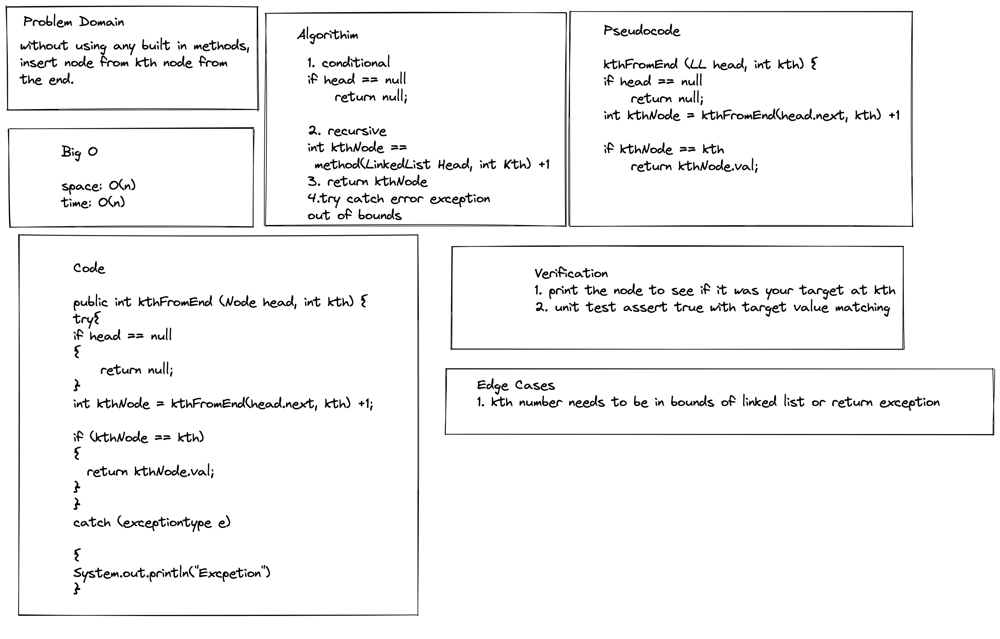

# Linked List Kth

Without using any built in methods,
insert node from kth node from
the end.
### Contributor: Joshua McCluskey

### White Board Process

## Approach & Efficiency

This approach all based on the counter and once counter reaches kth node it is complete.

The Big O for time O(n) counting up linear  and the space is O(n) due to recursive method.

#### Work Time: 2 hours
