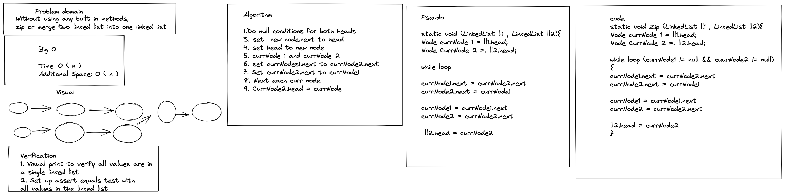

# Linked List Zip

Without using any built in methods,
zip or merge two linked list into one linked list
### Contributor: Joshua McCluskey

### White Board Process

## Approach & Efficiency

This approach was swaping the currNode of one list with the other.
Using the visual of merging into traffic helped a lot.
Repeat until both list are null.

The Big O for time O(n) linear until each node is added 1 by 1  and the space is O(n) linked list growing by one.

#### Work Time: 2 hours
